# CGRA 2021/2022

## Group T07G04
-Bruno Pascoal, up201705562
-Luís Cunha, up201709375

## Project

- No Ponto 1 criamos as tracks e aplicamos a textura;
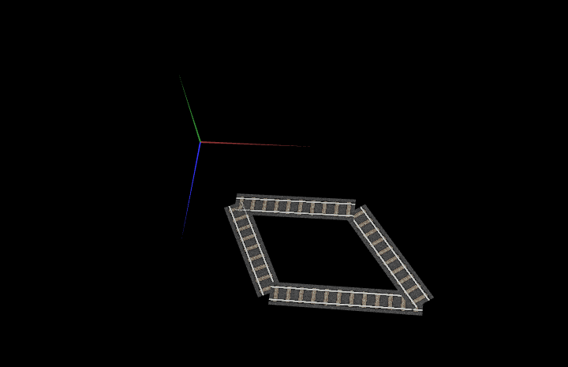  
- No Ponto 2 criamos um circulo através de triangulos e aplicamos textura;
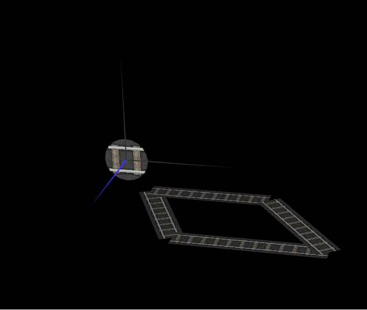
- No Ponto 3 criamos um cilindro através de triangulos;
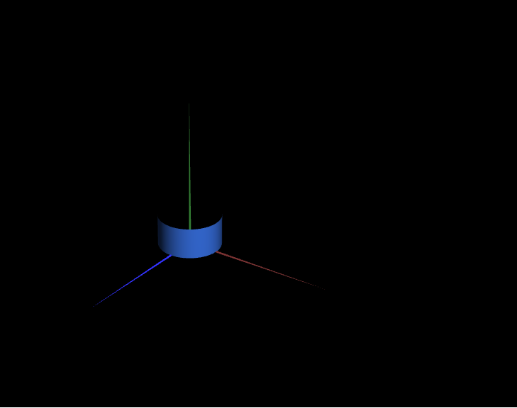
- No ponto 4 criamos uma esfera, utilizando slices e stacks para dividir e fazer uma figura, também aplicamos a textura da Terra na mesma;
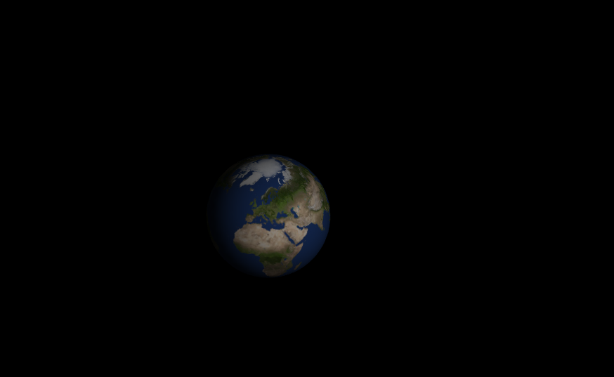
- No Ponto 5 criamos um comboio, usando várias figura geométricas criadas anteriormente;
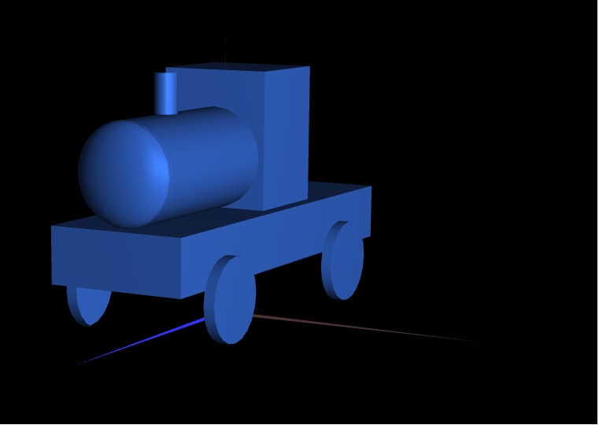
- No Ponto 6 aplicamos criamos um cubo de dimensão 50 e aplicamos a texturas fornecidas.
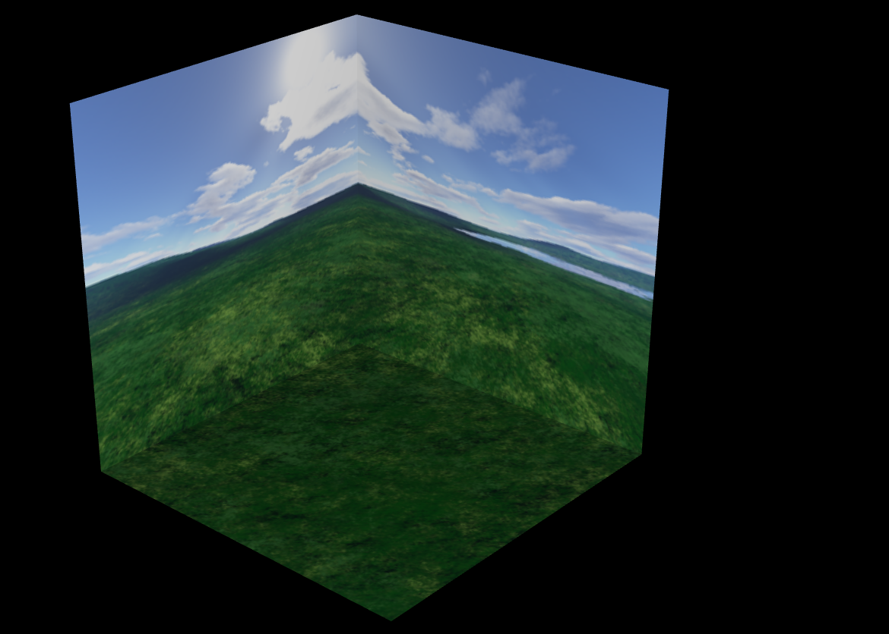
- No Ponto 7 criamos o guindaste e os troncos de madeira, também fizemos com que fosse possivel o guindaste segurar os troncos de madeira.

- No Ponto 8 fizemos com que fosse possivel armazenar os blocos de madeira num contentor.
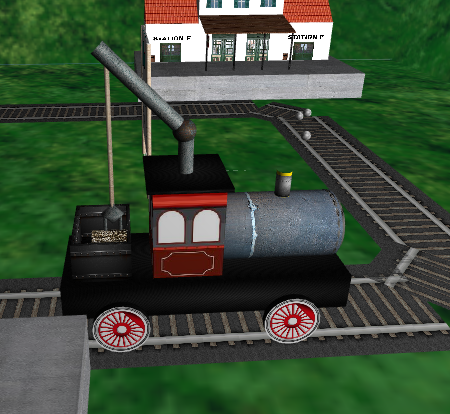
- No Ponto 9 fizemos com que a track fosse arredondada nas suas extremidades, e corrigimos o movimento do comboio.
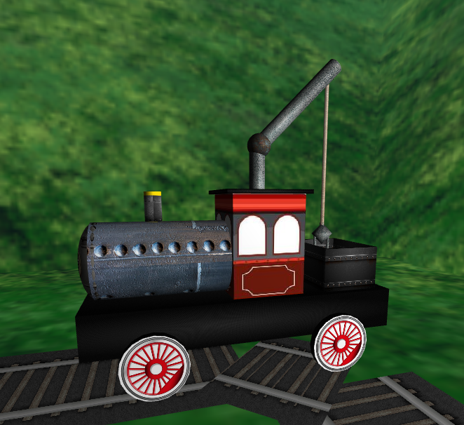
- No ponto 10 criamos a estação e aplicamos textura na mesma.
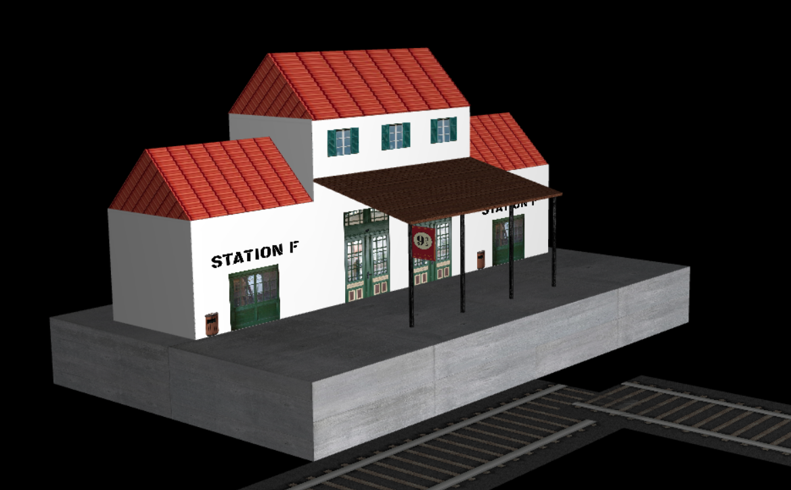
- O ponto 11 é a imagem aérea do nosso projeto;
 
- No Ponto 12 aplicamos texturas no comboio.
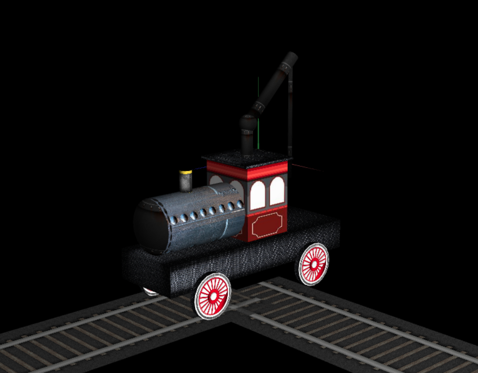
- No Ponto 13 criamos o fumo da chaminé do comboio.
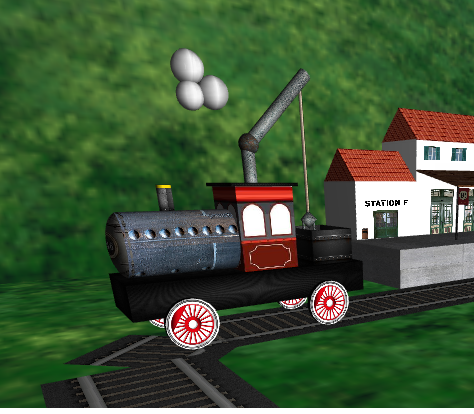
- No Ponto 14 aplicamos ao MyCubeMap as nossas texturas.
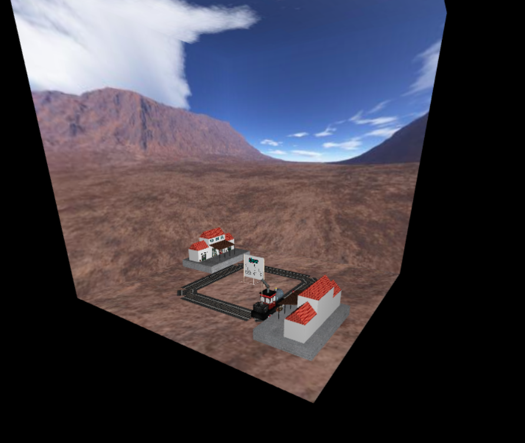

- Foram efetuadas todas as funcionalidades pedidas, incluindo as valorizações.

